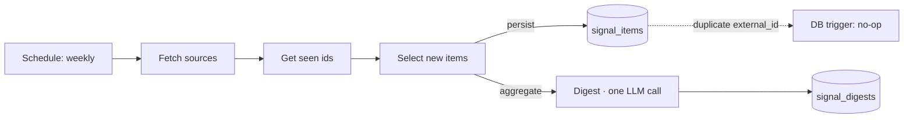
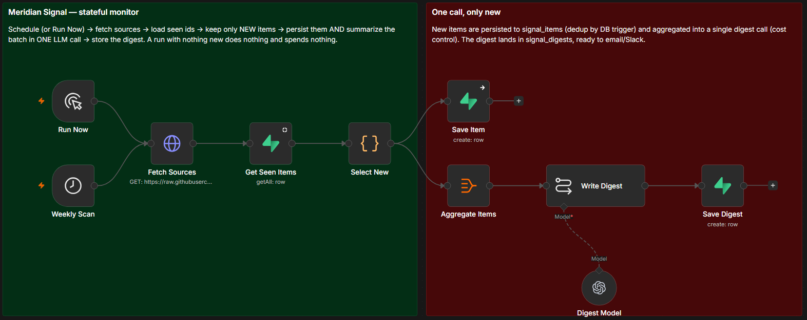

# Meridian Signal

> A scheduled competitive-intelligence monitor: it watches competitor changelogs and industry news, surfaces **only what's new**, and writes a one-glance digest — so the product team stops manually trawling sources.

**Sample digest — real output from a live run** (6 competitor/industry items → one LLM call):

> **TL;DR:** Key competitors are enhancing AI features, pricing models, and compliance, which could impact Meridian's market positioning.
>
> - **Loopwork Changelog** — Loopwork ships AI standup summaries: Automating standup summaries could challenge Meridian's meeting-management features.
> - **Cardinal Analytics Blog** — Cardinal adds warehouse-native dashboards: Real-time dashboards enhance analytics speed, raising the bar for Meridian's reporting.
> - **Tasklet Release Notes** — Tasklet introduces usage-based pricing: This model could attract small teams, increasing competition for Meridian's customer base.
> - **SaaS Weekly** — Buyers increasingly expect native AI, not add-ons: AI features are now table stakes; Meridian must integrate them, not gate them.
> - **Loopwork Changelog** — Loopwork opens a public API for automations: A public API invites custom workflows, potentially pulling developers away from Meridian.
> - **Cardinal Analytics Blog** — Cardinal SOC 2 Type II and HIPAA now available: Compliance certifications open regulated industries to Cardinal, pressuring Meridian's reach.

## Problem → Solution

**Problem.** Product teams manually check competitor changelogs and industry news — repetitive, noisy, and easy to let slip. Most of what you re-read you've already seen.

**Solution.** A scheduled workflow that pulls the sources, **remembers what it has already seen** (state in Postgres), summarizes only the new items in a **single LLM call**, and writes a Markdown digest for delivery.

**Outcome.** First run digests everything new; the next run with no new items does nothing (no noise, no spend); add one item and only that item shows up. Statefulness, not a re-summary every time.

> **About the scenario.** Built for **◆ Meridian**, a fictional B2B SaaS. Sources are fictional competitor/industry items. No real data.

## Architecture

**The live workflow in n8n** (every block is documented on the canvas):

Full walkthrough: [`docs/ARCHITECTURE.md`](docs/ARCHITECTURE.md).

## Engineering

- **Statefulness** — each source item has a stable `external_id`; the run compares against `signal_items` and processes only what's new. Re-runs are quiet.
- **Cost control** — new items are summarized in **one** LLM call per run (not one per item, not re-summarizing seen items). A quiet run spends nothing on the model.
- **Idempotency** — a DB trigger makes a repeated `external_id` a no-op, so persistence can never double-store.
- **Observability** — every seen item and every digest is a queryable row (`signal_items`, `signal_digests`).
- **Scheduling & delivery** — runs on a Schedule Trigger; the digest is stored for delivery (a real deployment would email/Slack it).

Design decisions: [`docs/DECISIONS.md`](docs/DECISIONS.md).

## How it works

1. The **Schedule Trigger** fires (weekly; also runnable on demand).
2. **Fetch sources** pulls the feed of items.
3. **Get seen** loads the `external_id`s already stored.
4. **Select new** keeps only items not seen before.
5. New items are **persisted** to `signal_items` and, in parallel, **aggregated into one digest** (single LLM call) saved to `signal_digests`.

## Run it yourself

**Prerequisites:** n8n, a Supabase project, and an OpenAI API key.

1. Copy `.env.example` to `.env` and fill values.
2. Apply [`database/schema.sql`](database/schema.sql) in Supabase.
3. Import `workflows/*.json` into n8n; set the OpenAI + Supabase credentials.
4. Run the workflow once (digests all seed items), then again (nothing new). Add an item to [`sources/feed.json`](sources/feed.json) and re-run to see only that item surface.

Detailed operations: [`docs/RUNBOOK.md`](docs/RUNBOOK.md).

## Results

Verified end-to-end on live n8n + Supabase:

| Run | Result |
|-----|--------|
| Run 1 (cold, empty state) | 6 items surfaced → **one** LLM call → digest written (`item_count = 6`); 6 rows in `signal_items` |
| Run 2 (warm, no changes) | 0 new items → **no digest, no LLM call** (zero model spend) |

State after both runs: `signal_items = 6`, `signal_digests = 1` — the second run added nothing. Adding a new item to the feed surfaces only that item on the next run. See [`eval/`](eval/).

## Stack & credits

- **Orchestration & scheduling:** n8n
- **Summarization:** OpenAI (one call per run)
- **State & digests:** Supabase (Postgres)

---

Maintained by **Augusto Henrique** — AI Automation Engineer · [github.com/augusto-hjs](https://github.com/augusto-hjs)

🇧🇷 Resumo em português

Monitor agendado de inteligência competitiva: observa changelogs de concorrentes e notícias, **lembra o que já viu** (estado no Postgres), resume **só os itens novos em uma única chamada de LLM** e grava um digest em Markdown pra entrega. Destaques: statefulness (dedup), controle de custo (1 chamada por rodada, rodada sem novidade não gasta), idempotência por trigger no banco e observabilidade (itens e digests viram linhas consultáveis). n8n + OpenAI + Supabase.

