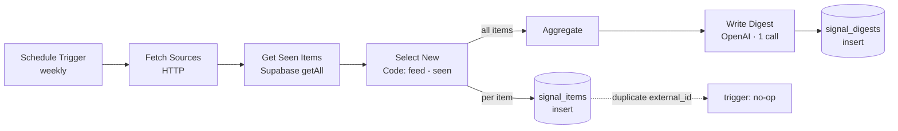

# Architecture — Meridian Signal

## Overview

A scheduled n8n workflow that monitors sources statefully: it processes only items it hasn't seen, summarizes the new batch in a single LLM call, and persists both the seen items and the digest.

## Diagram

## Data flow

| Step | Node | Purpose |
|------|------|---------|
| 1 | Schedule Trigger | Fire weekly (manual run also supported) |
| 2 | Fetch Sources | Pull the feed (`{ items: [...] }`) |
| 3 | Get Seen Items | Load `external_id`s already stored |
| 4 | Select New | Keep feed items whose `id` isn't in the seen set |
| 5a | Insert Items | Persist each new item to `signal_items` (dedup-safe) |
| 5b | Aggregate → Write Digest → Save Digest | One LLM call over the new batch → `signal_digests` |

## Data model

See [`../database/schema.sql`](../database/schema.sql):
- `signal_items(external_id unique, source, title, url, published)` with a `signal_items_skip_duplicate` `BEFORE INSERT` trigger (idempotent persistence).
- `signal_digests(item_count, digest_md)` — the delivered output.
RLS is on, deny-by-default; n8n uses the service role key.

## Why one LLM call

Summarizing the whole new batch in a single call (rather than one call per item, or re-summarizing everything each run) is the cost lever: a run with **no** new items makes **zero** model calls, and a busy run scales with the number of *new* items, not the size of the corpus.

## Failure modes & handling

| Failure | Handling |
|---------|----------|
| Source fetch fails | n8n retry with backoff; run ends without a digest (next run resumes) |
| Duplicate item across runs | Unique `external_id` + trigger → no double-store |
| No new items | `Select New` returns 0 → downstream skipped, no empty digest, no spend |
| LLM error | Node retry; items already persisted are not re-summarized next run |

## Scaling notes

For many sources, fan out fetches and merge; for high volume, batch the digest by source or time window. State lives in Postgres, so horizontal runs stay consistent.
